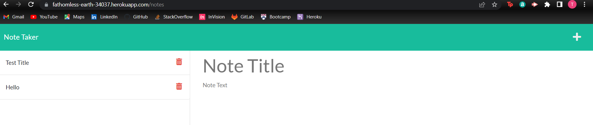

# Note Taker
    
## Description
    
The purpose of this project is to use Express.js to build the back end for a note taking application that saves and retrieves not data from a JSON file.  The goal is to become comfortablem  with back end development and linking it to the front end.
    
## Table of Contents

[Description](#description)

[Screenshot](#screenshot)

[Link](#link)

[Usage](#usage)

[License](#license)

[Shout-out](#shout-out)

[Questions](#questions)

## Screenshot 

## Link

[https://fathomless-earth-34037.herokuapp.com/](https://fathomless-earth-34037.herokuapp.com/)

## Usage
    
Type in your notes as you would like them to be saved into the application.
    
## License 

## Shout-Out

Voravich S. and Freddy Kwak who are in my study group and helped me understand concepts relevant to this challenge.

## Questions?

[https://github.com/TabithaLy/note-taker](https://github.com/TabithaLy/note-taker)